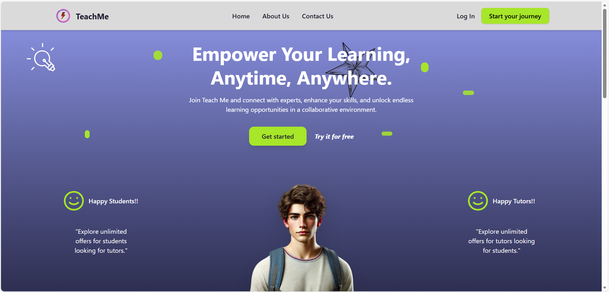

# TeachMeApp 🎓

> A comprehensive online tutoring marketplace connecting students and teachers with real-time video, chat, and course management tools.

**TeachMeApp** is a sophisticated full-stack platform designed to facilitate seamless online education. It features a robust marketplace for creating and booking course offers, real-time communication capabilities (video calls and chat), and secure payment processing. Built with the MERN stack and modern cloud services, it demonstrates a scalable architecture for meaningful user interactions.

---


## ✨ Key Features

### 🔐 Authentication & Security
-   **Secure Access**: JWT-based authentication with Bcrypt password hashing.
-   **Role-Based Access Control (RBAC)**: Distinct dashboards and permissions for students, teachers, and admins.
-   **Protected Routes**: Middleware ensures secure navigation and data privacy.

### 🎥 Real-Time Communication
-   **Video Conferencing**: High-quality video calls powered by **ZegoCloud integration**.
-   **Live Chat**: Instant messaging system built with **Socket.io** for seamless collaboration between users.
-   **Interactive Rooms**: Dedicated virtual classrooms for scheduled sessions.

### 🛒 Marketplace & Courses
-   **Dynamic Offers**: Teachers can create and manage detailed course offers.
-   **Course Management**: Comprehensive tools for creating, updating, and viewing courses.
-   **Advanced Search**: Filter and browse offers by categories and types.
-   **User Profiles**: Customizable profiles showcasing expertise and availability.

### 💳 Payments & Transactions
-   **Secure Payments**: Integrated **Stripe** payment gateway for safe and reliable transactions.
-   **Booking System**: Streamlined process for booking sessions and purchasing courses.

---

## 🛠️ Technology Stack

### Frontend
-   **Core**: [React](https://react.dev/) (Vite)
-   **Styling**: [TailwindCSS](https://tailwindcss.com/) & App.css
-   **State Management**: [Redux Toolkit](https://redux-toolkit.js.org/)
-   **Routing**: [React Router](https://reactrouter.com/)
-   **Animations**: [Framer Motion](https://www.framer.com/motion/)
-   **UI Components**: Custom components + React Hot Toast for notifications
-   **HTTP Client**: Axios

### Backend
-   **Runtime**: [Node.js](https://nodejs.org/)
-   **Framework**: [Express.js](https://expressjs.com/)
-   **Database**: [MongoDB](https://www.mongodb.com/) (Mongoose ODM)
-   **Socket**: [Socket.io](https://socket.io/) for real-time events

### Services & Integrations
-   **Video/Audio**: [ZegoCloud UI Kit](https://www.zegocloud.com/)
-   **Payments**: [Stripe API](https://stripe.com/)
-   **Storage**: [Cloudinary](https://cloudinary.com/) (Media management)

---

## 🚀 Getting Started

Follow these instructions to set up the project locally.

### Prerequisites
-   **Node.js** (v16+ recommended)
-   **npm** or **yarn**
-   **MongoDB** (Local instance or Atlas URI)

### Installation

1.  **Clone the repository**
    ```bash
    git clone https://github.com/Anaselll/TeachMeApp.git
    cd TeachMeApp
    ```

2.  **Backend Setup**
    ```bash
    cd backend
    npm install
    ```
    Create a `.env` file in the `backend` directory:
    ```env
    PORT=5000
    MONGO_URI=your_mongodb_connection_string
    JWT_SECRET=your_jwt_secret
    STRIPE_SECRET_KEY=your_stripe_secret_key
    CLOUDINARY_CLOUD_NAME=your_cloud_name
    CLOUDINARY_API_KEY=your_api_key
    CLOUDINARY_API_SECRET=your_api_secret
    ```

3.  **Frontend Setup**
    ```bash
    cd ../frontend
    npm install
    ```

### Usage

1.  **Start the Backend Server**
    ```bash
    cd backend
    npm start
    # or for development
    npm run dev
    ```

2.  **Start the Frontend Development Server**
    ```bash
    cd frontend
    npm run dev
    ```

3.  **Access the Application**
    Open your browser and navigate to `http://localhost:5173` (or the port shown in your terminal).

---

## 📂 Project Structure

```
TeachMeApp/
├── backend/            # Express.js server & API
│   ├── components/     # Reusable backend components
│   ├── controllers/    # Request handlers
│   ├── models/         # Mongoose schemas
│   ├── routes/         # API endpoints
│   └── index.js        # Entry point
│
└── frontend/           # React application
    ├── src/
    │   ├── pages/      # Page components (Home, Dashboard, etc.)
    │   ├── components/ # Reusable UI components
    │   ├── context/    # React Context providers
    │   └── assets/     # Static assets
    └── vite.config.js  # Vite configuration
```
